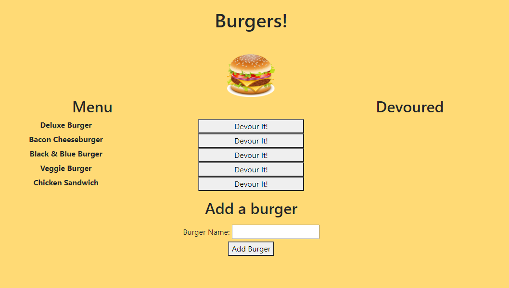

# Burger Logger
  

  ## Description
  
  Create delicious burgers to be devoured. Store the data with JawsDB and deployed on Heroku.
  
  ---
  
  ## Table of Contents
  
  - [Installation](#installation)
  - [Usage](#usage)
  - [Credits](#credits)
  - [Contributing](#contributing)
  - [Tests](#tests)
  - [Questions](#questions)
  - [License](#license)
  
  ---
  
  ## Installation
  
  No installation necessary. Simply visit the active URL listed below.
  
  URL for active webpage: [https://shielded-refuge-64505.herokuapp.com/](https://shielded-refuge-64505.herokuapp.com/)
  
  URL for repository: [https://github.com/tonyschwebach/burger-logger](https://github.com/tonyschwebach/burger-logger)
  
  ---
  
  ## Usage
  
  add burger if desired, otherwise click the button to devour your burger
  
  App Screenshot 

  

  App Demo [(also available on Google Drive)](https://drive.google.com/file/d/1cJ0gpmtmTHbs5l3eAhEdCbkR5VMYYIh5/view?usp=sharing)

  
  
  ---
  
  ## Credits
  
  Georgia Tech Coding Bootcamp staff and Full-Time cohort for their collaboration and guidance.

  Special credit to the cats app from the GT Bootcamp which served as a base and resource for this app.
  
  
  ---
  
  ## Contributing

  Not currently taking contributions
  
  ---
  
  ## Tests

  N/A
  
  ---
  
  ## Questions
  
  Please contact [tony.schwebach.developer@gmail.com](mailto:tony.schwebach.developer@gmail.com) or tonyschwebach on [Github](https://github.com/tonyschwebach/).
   
  ---
  
## License

MIT License

Copyright (c) [2021] [tonyschwebach]
    
Permission is hereby granted, free of charge, to any person obtaining a copy
of this software and associated documentation files (the "Software"), to deal
in the Software without restriction, including without limitation the rights
to use, copy, modify, merge, publish, distribute, sublicense, and/or sell
copies of the Software, and to permit persons to whom the Software is
furnished to do so, subject to the following conditions:

The above copyright notice and this permission notice shall be included in all
copies or substantial portions of the Software.

THE SOFTWARE IS PROVIDED "AS IS", WITHOUT WARRANTY OF ANY KIND, EXPRESS OR
IMPLIED, INCLUDING BUT NOT LIMITED TO THE WARRANTIES OF MERCHANTABILITY,
FITNESS FOR A PARTICULAR PURPOSE AND NONINFRINGEMENT. IN NO EVENT SHALL THE
AUTHORS OR COPYRIGHT HOLDERS BE LIABLE FOR ANY CLAIM, DAMAGES OR OTHER
LIABILITY, WHETHER IN AN ACTION OF CONTRACT, TORT OR OTHERWISE, ARISING FROM,
OUT OF OR IN CONNECTION WITH THE SOFTWARE OR THE USE OR OTHER DEALINGS IN THE
SOFTWARE.
  
